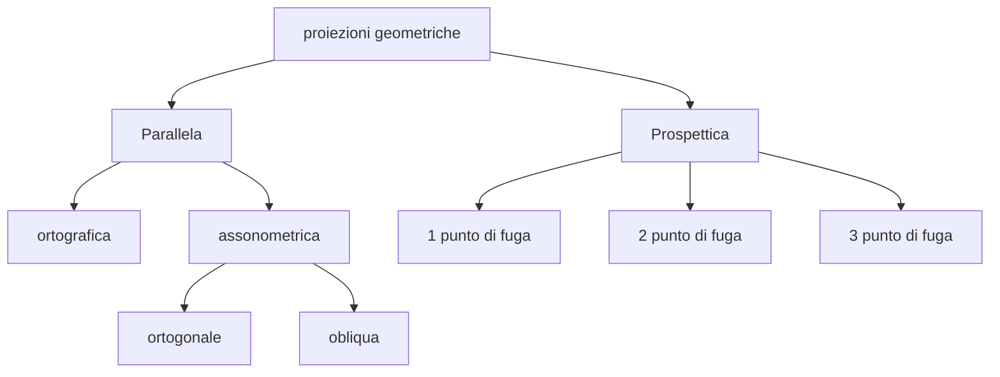

# PROIEZIONI GEOMETRICHE

```mermaid
flowchart TD
A[proiezioni geometriche]
B[Parallela]
C[Prospettica]
D[ortografica]
E[1 punto di fuga]
F[2 punto di fuga]
G[3 punto di fuga]
H[assonometrica]
I[ortogonale]
J[obliqua]
A --> B & C
B --> D & H
C --> E & F & G
H --> I & J 
```

