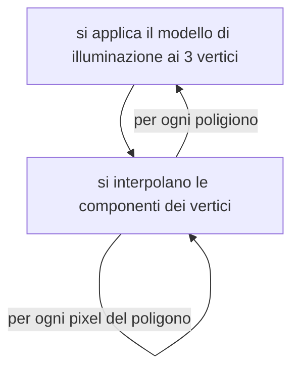
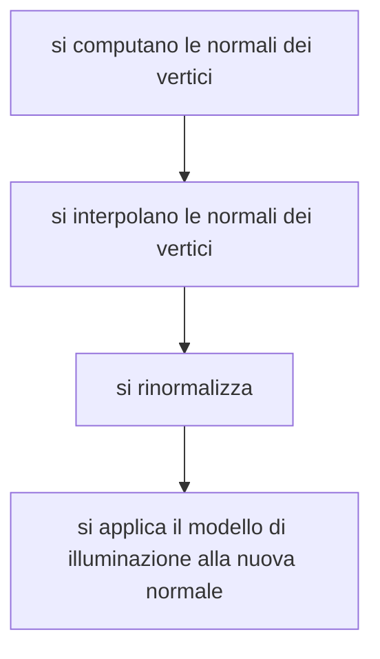

# ILLUMINAZIONE

la fase di [rasterizzazione](ALGORITMI_RASTERIZZAZIONE.md) non e sufficiente per determinare il colore di un oggetto dato che esso nel mondo reale e determinato dalla quantità e dalle componenti di luce che l'oggetto stesso riflette e che viene catturata da'occhio umano

Il fenomeno fisico in questione viene catturato dalla [rendering equation](https://en.wikipedia.org/wiki/Rendering_equation) oggetto matematico fin troppo complesso per essere risolto analiticamente

I modelli di illuminazione usati in computer graphics sono approssimazioni della [rendering equation](https://en.wikipedia.org/wiki/Rendering_equation) suddivisi in locali e globali

| MODELLI LOCALI                                                                              | MODELLI GLOBALI                                                                                    |
| ------------------------------------------------------------------------------------------- | -------------------------------------------------------------------------------------------------- |
| modelli che tengono conto della **luce emessa dalle fonti e dalle proprieta del materiale** | modelli che tengono conto anche della luce riflessa dalle **altre superfici presenti nella scena** |

## MODELLO DI ILLUMINAZIONE DI PHONG

E' un modello di illuminazione locale definito come segue:

$$
luce = illuminazione \space ambiente + componente \space riflessiva
$$

la componente riflessiva puo essere **diffusa** o **speculare**

### COMPONENTE D'AMBIENTE

Componente dovuta alle caratteristiche specifiche del materiale di un oggetto

$$
I_{da} = k_aI_a
$$

### COMPONENTE DI RIFLESSIONE DIFFUSA

Tipica dei materiali opachi, caratterizzata dal fatto che la luce che colpisce un punto si **riflette in tutte le direzioni allo stesso modo**

Questa componente dipende strettamente dall'angolo tra la normale del punto e la direzione del raggio di luce che colpisce l'oggetto

$$
I_{dr}= k_dI_l\cos({\theta}) = k_dI_l(L\bullet N)
$$

>[!NOTE] si ricorda che $L$ e $N$ sono vettori normali

### COMPONENTE DI RIFLESSIONE SPECULARE

Questa componente approssima il comportamento di riflessione della luce dei materiali lucidi che **non e omogenea in tutte le direzioni**

Questa componente dipende anche dalla posizione dell'osservatore 

$$
I_r = k_sI_l (\cos(\alpha))^n
$$

dove gli scalari $n,k_s$ sono dipendenti dal materiale dell'oggetto

## COMPUTAZIONE DELLA LUCE

Nella pipeline di rendering e necessario includere un algoritmo in grado di computare il colore di un triangolo illuminato, questo viene fatto per mezzo degli **algoritmi di shaiding**

### FLAT SHADING

dato un poligono, si computa la normale per ogni faccia e si applica il modello di illuminazione al centro della faccia 

Questa risulta essere una delle soluzioni più semplici, ma il risultato ottenuto e abbastanza mediocre, inoltre il risultato soffre dell'effetto di band match

### GOURAUD SHADING

Algoritmo che sfrutta il concetto di interpolazione dei vertici,

>[!NOTE] in questo caso la normale e definita a livello di vertice come somma delle normali delle superfici adiacenti

qui un esempio di  [implementazione in webGL](WEBGL.md#IMPLEMENTAZIONE%20DELL'%20[ILLUMINAZIONE](ILLUMINAZIONE.md))

### PHONG SHADING

Variante del [gouraud shading](#GOURAUD%20SHADING) che effettua l'interpolazione delle normali dei vertici prima di applicare il modello di illuminazione

[PREVIOUS](pages/CLIPPING.md) [NEXT](pages/TEXTURE_MAPPING.md)
