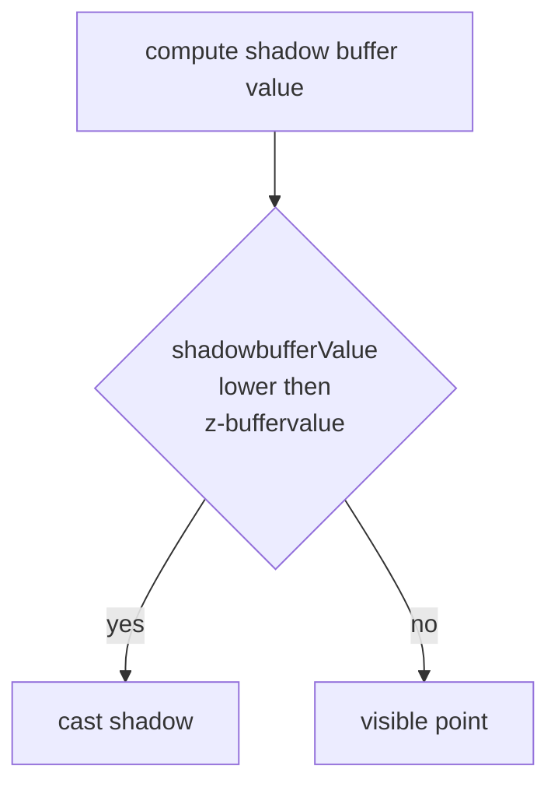

# SHADOWING

Lo shadowing e la pratica di computare le ombre dato un oggetto, una fonte luminosa e un osservatore, un punto e in ombra se la fonte luminosa non lo raggiunge ed e visibile dall'osservatore

Le ombre variano molto a seconda delle dimensioni dell'oggetto, le condizioni di illuminazione e la posizione dell'osservatore, risultano perciò molto complesse da computare

## OMBRA VS PENOMBRA

L'ombra e quella che una fonte luminosa proietta nei punti non direttamente raggiungibili da essa, mentre la penombra e una zona di punti non raggiunti completamente dalla luce

>[!WARNING] Per poter avere condizioni di penombra la fonte luminosa **non deve essere puntiforme**!  

>[!IMPORTANT] se la posizione relativa della fonte luminosa e dell'osservatore varia e necessario computare di nuovo tutte le ombre (*molto costoso*)

## OMBRE SU PIANI

Algoritmo che punta a disegnare data una fonte luminosa e un oggetto una geometria piana da poter colorare con il colore ombra, questo viene fatto per mezzo di una **proiezione su piano**

### OMBRE SU PIANI CARTESIANI

IN questo caso speciale e sufficiente trovare la coordinata $X$ sul piano del punto $P$ ottenuto come proiezione e lo si può fare con una similitudine fra triangoli:

si ha quindi che i triangoli di lati $L,V$ e $L,P$ sono paragonabili

$$
\frac{P_x- L_x}{V_x -L_x} = \frac{L_y}{L_y-V_y} \Rightarrow
$$
$$
P_x = \frac{L_yV_x -L_xV_y}{L_y-V_y}
$$

Nel caso in cui il piano non sia cartesiano e necessario proiettare i vertici del poligono sul piano arbitrario

## OMBRE NELLO [Z-BUFFER](REAL_TIME_RENDERING.md#ALGORITMO%20Z-BUFFER) SHADOW-BUFFER

Per implementare le ombre nello [z-buffer](REAL_TIME_RENDERING.md#ALGORITMO%20Z-BUFFER) si ricorre a un algoritmo detto **shadow-buffer**

Lo shadow buffer e un buffer in memoria che computa l'algoritmo [z-buffer](REAL_TIME_RENDERING.md#ALGORITMO%20Z-BUFFER) ma dal punto di vista della sorgente luminosa

### LIMITAZIONI DELLO SHADOW BUFFER

Lo shadow buffer risulta fattibile solo per scene con singole fonti di luce in quanto per poter computare multiple fonti si necessita di una fonte di luce per ognuna di esse

## ALIASING

Quando si computano le ombre si hanno sempre problemi di aliasing dovuti al fatto che l'algoritmo [shadow buffer](#OMBRE%20NELLO%20[Z-BUFFER](REAL_TIME_RENDERING.md%20ALGORITMO%20Z-BUFFER)%20SHADOW-BUFFER) compie una decisione netta sul mettere in ombra o meno un pixel, in questo caso si applicano tecniche simili a quanto visto per le [textures](TEXTURE_MAPPING.md#GESTIRE%20L'ALIASING)

## LUCI NON PUNTIFORMI

Nella realta le luci non sono mai puntiformi, questo porta a ombre morbide come visto in [precedenza](#OMBRA%20VS%20PENOMBRA) in questo caso si adottano tecniche di blur delle ombre per simulare l'effetto di una luce non puntiforme

[PREVIOUS](pages/TEXTURE_MAPPING.md) [NEXT](pages/MESH_3D_POLIGONALI.md)
