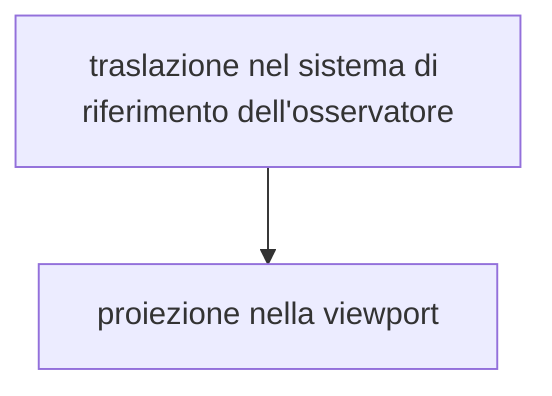

# TRASFORMAZIONI DI VISTA

Obbiettivo, ottenere dal modello 3D una rappresentazione da disegnare sul frame buffer grafico

si trasla l'oggetto nel sistema di riferimento dell'osservatore per mezzo di una matrice di cambiamento di base, per poi effettuare una proiezione geometrica 

la matrice di cambiamento di base $VM$ (view matrix) e composta come segue

$$
VM =\begin{bmatrix}
Xe_{1} &Xe_{2}&Xe_{3}& 0\\
Ye_{1} &Ye_{2}&Ye_{3}& 0\\
Ze_{1} &Ze_{2}&Ze_{3}& 0\\
0 &0&0 & 1\\
\end{bmatrix}
$$

Dove i vettori $Xe,Ye,Ze$ si possono ricavare dalle seguenti considerazioni geometriche

$$
\displaylines{
Ze = Vd/\Vert Vd \Vert = -(Vp -O)/\Vert Vp -O \Vert \\
Xe = \frac{Ze \times Vu}{\Vert Ze \times Vu\Vert} \\
Ye = -\frac{Ze \times Xe}{\Vert Ze \times Xe\Vert} \\
}
$$

Traslando la rappresentazione in un sistema di coordinate polari si ottiene

$$
VM =\begin{bmatrix}
-sin(\theta)&cos(\theta)&0& 0\\
-cos(\phi)cos(\theta)&-cos(\phi)sin(\theta)&sin(\phi)& 0\\
-sin(\phi)cos(\theta)&-sin(\phi)sin(\theta)&-cos(\phi)& 0\\
0 &0&0 & 1\\
\end{bmatrix}
$$