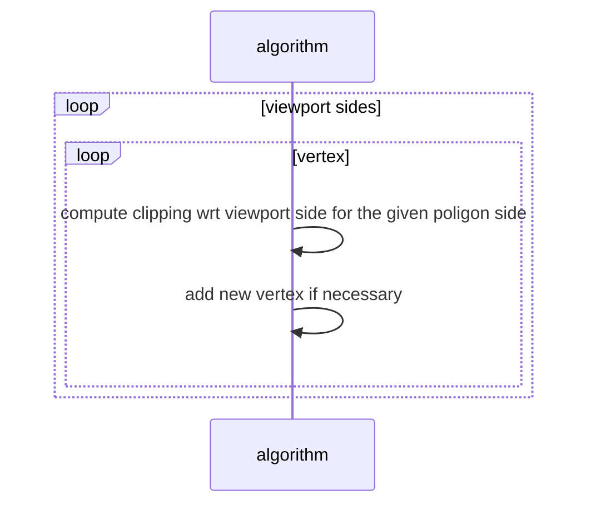

# Clipping di linee

Il clipping e la pratica di **rimuovere** dalla pipeline di rendering **gli oggetti che non fanno parte della viewing window** in modo da ridurre il processo ai soli elementi necessari e migliorare le performance della computazione

## Algoritmo di Cohen-Sutherland

la viewport viene estesa per includere anche le zone esterne alla viewport, alle zone viene applicata un etichetta codificata per mezzo di un valore binario

>[!NOTE] i bit a $1$ specificano a quanti e a quali lati della viewport il vertice che si trova li e esterno

di conseguenza codificati i vertici $p_1,p_2$ in $c_1,c_2$ si ha che

$$
\begin{cases}
c_1 \land c_2 \neq 0 \rightarrow linea \space scartata \\
c_1 \lor c_2 \neq 0 \rightarrow linea \space accettata \\
\end{cases}
$$

In caso di linee che intersecano più piani si sfrutta la forma parametrica per spezzarle in più segmenti, questo comporta un costo computazionale aggiuntivo

#### Estensione al 3d (*rispetto a un parallelepipedo*)

Data una linea come segue

si identifica il valore del parametro $t$ che fa eccedere la linea rispetto a una data coordinata (*in questo caso la coordinata $y$*) 

$$
y_{max} = y_0 + (y_1-y_0)t \Rightarrow t = \frac{y_{max} - y_0}{y_1-y_0}
$$

Si determinano i valori delle altre coordinate di conseguenza identificando il punto di collisione con la viewport

$$
\begin{cases}
x_* = x_0 + (x_1-x_0)\frac{y_{max} - y_0}{y_1 - y_0} \\
y_* = y_{max} \\
z_* = z_0 + (z_1-z_0)\frac{y_{max} - y_0}{y_1 - y_0} \\
\end{cases}
$$

si procede cosi per tutti e $3$ gli assi

## Clipping di poligoni

Il clipping dei singoli poligoni e più complicato che nel caso delle [singole linee](clipping.md) in quanto **non e detto che dal clipping di un poligono risulti un solo poligono o un poligono con lo stesso numero di vertici**

>[!ERROR] in questo caso ci sono 2 poligoni risultanti :(

## Stutherland-Hodgman clipping

L'idea di base e quella di considerare i lati della viewport singolarmente nella fase di clipping

L'algoritmo cosi definito può essere parallelizzato in quanto per computare un lato del poligono non e necessario computare i precedenti

#### GENERALIZZAZIONE AL CASO 3D

L'algoritmo puo essere generalizzato al 3D, dato il parallelepipedo di vista (*frustum*) viene prima escluse le parti del poligono considerando il front e back plane,

Successivamente si effettua la [proiezione prospettica](proiezione_prospettica.md) e si procede al clipping rispetto alle altre facce

[PREVIOUS](pages/proiezione_prospettica.md) [NEXT](pages/illuminazione.md)
