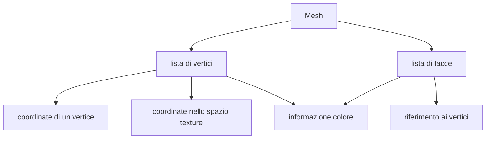

# Mesh 3D poligonali

In computer graphics gli oggetti 3D vengono approssimati da una rappresentazione della loro superficie detta **B-Rep** (*Boundary representation*) 
La superficie si assume sia una **[varietà](https://it.wikipedia.org/wiki/Variet%C3%A0_(geometria)) due-dimensionale(two-manifold)** (*l’intorno di ogni punto della superficie è omeomorfo ad un disco piano*)

Data questa rappresentazione di un oggetto 3D una Mesh 3D e una **approssimazione** per mezzo di poligoni (*in genere triangoli per semplificazione implementativa*)

## Mesh two-manifold: vincoli

Per far si che anche la mesh che approssima la superficie sia two-manifold un lato non può essere condiviso da 3 o più facce, e $n$ facce che condividono un vertice devono formare un ventaglio

### Normale ad una faccia

La normale di una faccia e definita come il prodotto vettoriale fra due lati **consecutivi e non collineari**

$$
n= (V_3 - V_2)\times(V_2 - V_1)
$$

>[!WARNING] la normale e uscente dal front della faccia, occhio al verso

## Mesh orientabile

Se la normale di tutti i poligoni di una mesh e rivolta verso la stessa direzione (*esterno/interno di una mesh*) allora si dice che la **mesh e orientabile**

>[!WARNING] Le facce di una mesh devono essere descritte in maniera coerente

## Coerenza delle facce

L’orientazione di due facce adiacenti è coerente **se i due vertici del loro lato in comune sono in ordine inverso**. Vuol dire che l’orientazione non cambia attraversando il lato in comune.

## Mesh chiusa vs mesh aperta

Una mesh aperta si contraddistingue da una mesh chiusa perché **presenta lati vertici e facce di bordo** 

## Topologia e geometria di una mesh

Una mesh poligonale e' caratterizzata da una **geometria e da una topologia**:

| GEOMETRIA                                     | TOPOLOGIA                                    |
| --------------------------------------------- | -------------------------------------------- |
| come sono disposti i vertici nello spazio  | come i vertici sono connessi da lati e facce |

>[!WARNING] due mesh possono condividere la stessa geometria ma descrivere due modelli diversi per mezzo della loro topologia!

## Mesh storing

Le informazioni per comporre una mesh vengono salvate in maniera indicizzata

>[!NOTE] per il salvataggio delle mesh 3D uno dei formati possibili e il formato [OBJ](https://en.wikipedia.org/wiki/Wavefront_.obj_file) commercializzato dalla Alias-Wavefront

## Editing di mesh 3D

L'editing di una mesh 3D e quel processo attraverso il quale si applicano modifiche a una mesh 3D aggiungendo rimuovendo facce,vertici e poligoni 

Le operazioni di editing che non alterano la topologia della mesh vengono detti **operatori di Eulero** alcuni esempi di tali operazioni sono:

- aggiunta/rimozione di un vertice
- aggiunta/rimozione di una faccia aggiungendo o eliminando un lato

### Rappresentazione comoda per l'editing: adiacenze

In fase di editing la rappresentazione per mezzo di facce e vertici non e ottimale in quanto ci si ritrova spesso a accedere a vertici e facce adiacenti ad altre, risulta comoda una struttura dati che tenga conto delle adiacenze

> struttura dati per la rappresentazione di lati

| name | start | end | left | right | pred | succ | pred | succ |
| ---- | ----- | --- | ---- | ----- | ---- | ---- | ---- | ---- |
| $a$  | $X$   | $Y$ | 1    | 2     | $b$  | $d$  | $e$  | $c$  |

[PREVIOUS](pages/shadowing.md) [NEXT](pages/html5.md)
