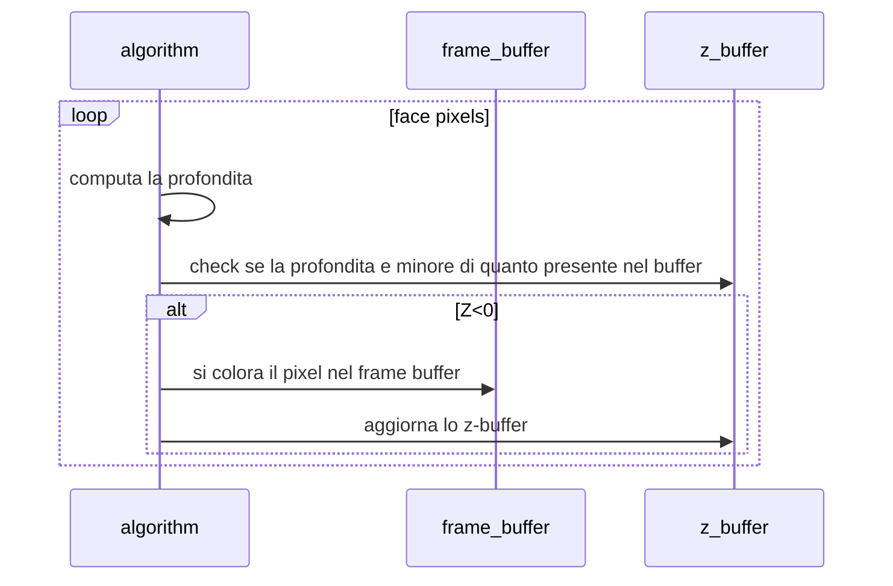

# ALGORITMI DI REAL TIME RENDERING

Uno dei problemi più interessanti in computer graphics e quello del rendering real time, con il quale si intende il **processo di resa di un immagine a partire da una descrizione geometrica della scena tridimensionale in questione**.

## Rimuovere le linee nascoste

Uno dei sotto problemi e quello della determinazione della visibilità o no di una determinata linea e/o faccia. Per questo sono stati presentati diversi che **sfruttano tutti il principio di ordinamento**

Gli algoritmi in questione sono stati classificati in base allo spazio operativo


| OBJECT SPACE                                      | IMAGE SPACE                                                   |
| ------------------------------------------------- | ------------------------------------------------------------- |
| La computazione viene effettuata sugli oggetti 3D | La computazione viene effettuata sull'immagine bidimensionale |

## Back face culling

Si applica a oggetti 3D convessi e consiste nella computazione della normale di un lato dell'oggetto, se questa e positiva allora la faccia non va disegnata


| VANTAGGI                                                                                                  | SVANTAGGI                                                       |
| --------------------------------------------------------------------------------------------------------- | --------------------------------------------------------------- |
| Aumenta la velocità di rendering rimuovendo circa la metà delle facce, che quindi non verranno processate | Funziona solo per superfici chiuse, convesse e senza buchi      |
| Non serve l’ordinamento delle facce                                                                       | Non può essere considerato un vero algoritmo di Hidden Surfaces |

## Algoritmo del pittore

si ordinano i triangoli dal più lontano al più vicino secondo la distanza $Z$ dall'osservatore e si rasterizzano in quest'ordine


| VANTAGGI                                                   | SVANTAGGI                                        |
| ---------------------------------------------------------- | ------------------------------------------------ |
| Si basa su un semplice agoritmo di ordinamento di poligoni | E’ difficile definire un criterio di ordinamento |
|                                                            | Ridisegna i pixel tante volte                    |
|                                                            | l'ordinamento puo essere costoso                 |

## Visibility buffer

Si basa sul concetto di zona di visibilità, dopo aver riordinato i poligoni questi vengono disegnati e si tiene traccia della zona già ricoperta da altri poligoni


| VANTAGGI                                                    | SVANTAGGI                                                      |
| ----------------------------------------------------------- | -------------------------------------------------------------- |
| Si basa su un semplice algoritmo di ordinamento di poligoni | difficile stabilire l'ordinamento                              |
| Ogni pixel viene disegnato una sola volta                   | l'ordinamento può essere costoso                               |
|                                                             | maggiore uso della memoria per via della regione di visibilità |

## Algoritmo z-buffer

E' l'algoritmo implementato dalle GPU moderne, lavora in image space e si basa su un estensione del frame buffer chiamata z-buffer

A seguito della [trasformazione di vista](trasformazioni_vista.md) si rasterizza la faccia e per ogni pixel viene presa in considerazione la distanza Z, se questa e minore di quanto presente nello z buffer si disegna il pixel e si aggiorna lo z-buffer di conseguenza



che in pseudo-codice si traduce come segue

```c
void zbuffer() {
	for (y = 0; y < Vymax; y++)
		for(x = 0; x < Vxmax; x++) {
			FrameBuffer(x,y) = BACK_Col;
			ZBuffer(x,y,INF_Val);
		}
		for (every triangle)
			for (all pixel (px,py) of the projected triangle) {
			pZ = computeZ(px,py);
			if (pZ < ZBuffer(px,py)){
				FrameBuffer(px,py) = computeColor(px,py);
				ZBuffer(px,py) = pZ;
			}
		}
	}
}
```

| VANTAGGI                                                                                                                       | SVANTAGGI                                                                |
| ------------------------------------------------------------------------------------------------------------------------------ | ----------------------------------------------------------------------|
| Non prevede alcun ordinamento, infatti il colore di un pixel e' determinato dal punto 3D (di Ze minore) di cui lui e' immagine | Richiede spazio di memoria aggiuntivo        |
| Semplice da implementare                                                                                                       | ancora una sorta di ridisegno anche se solo in memoria (copia del frame buffer) |

[PREVIOUS](pages/trasformazioni_vista.md) [NEXT](pages/algoritmi_rasterizzazione.md)
