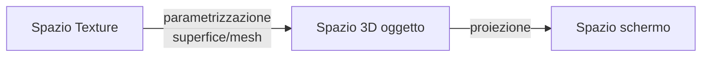

# Texture mapping

E il processo che consente di applicare immagini bidimensionali sulla superficie dei poligoni in modo da fornire modelli più realistici, viene realizzata definendo una trasformazione tra lo spazio texture e lo spazio 3D dei poligoni chiamata **parametrizzazione**

## Texture mapping 2d

in questo processo si associa ad ogni poligono un area di una texture 2D secondo una funzione di mapping, un esempio di funzione di mapping e il seguente

$$
[u,v]= f(x,y,z)\rightarrow (u,v): \begin{cases}
u=x \\
v=y
\end{cases}
$$

### Implementazione in contesto [z-buffer](real_time_rendering.md#ALGORITMO%20Z-BUFFER)

L'algoritmo [z-buffer](real_time_rendering.md#ALGORITMO%20Z-BUFFER) implica una computazione pixel per pixel, per implementare il texture mapping in questo contesto si applica la trasformazione inversa per ottenere un immagine del pixel (*detto **texel***), nello spazio texture

## Gestire l'aliasing

il processo di texture mapping necessita di trattamenti appositi per gestire l'aliasing in quanto un **dato punto del modello raramente si mappa in un pixel della texture con precisione**

L'aliasing si può presentare in due forme:

| MAGNIFICATION                            | MINIFICATION                              |
| ---------------------------------------- | ----------------------------------------- |
| quando un pixel e piu grande di un texel | quando il pixel e piu piccolo di un texel |

le tecniche più comuni per la gestione dell'aliasing sono:

- nearest neighbor
- bilinear interpolation

## Mip mapping

Una tecnica per risolvere il problema di aliasing in fase di texture mapping e quello di sfruttare multiple versioni di una data texture a differenti frazioni della risoluzione

Data un immagine di dimensione $2^n\times 2^n$ texel le versioni a bassa risoluzione si ottengono facendo la media dei 4 pixel vicini al livello precedente e si procede per $n-1$ livelli

In fase di applicazione della texture si trova il livello a cui il rapporto tra pixel e texel e $1:1$ (*approssimativamente*) e si applica il texture mapping

## Texture mapping con two part mapping 

Questo procedimento si basa su portare l'immagine in uno spazio 3D intermedio prima di attuare il mapping sul modello

Per esempio oortando la texture su un cilindro:

## Solid texturing

Pratica che coinvolge una texture 3D dove il modello viene immerso e il colore di ogni pixel viene definito dalle sue coordinate nello spazio texture

Questa pratica consente di simulare meglio  i materiali, tuttavia e molto esosa in termini di spazio in memoria e l'overhead computazionale non ne consente l'utilizzo in applicazioni realtime

### Texture procedurali

Il [solid texturing](#SOLID%20TEXTURING) trova il suo miglior impiego nella generazione di texture procedurali   

[PREVIOUS](pages/illuminazione.md) [NEXT](pages/shadowing.md)
