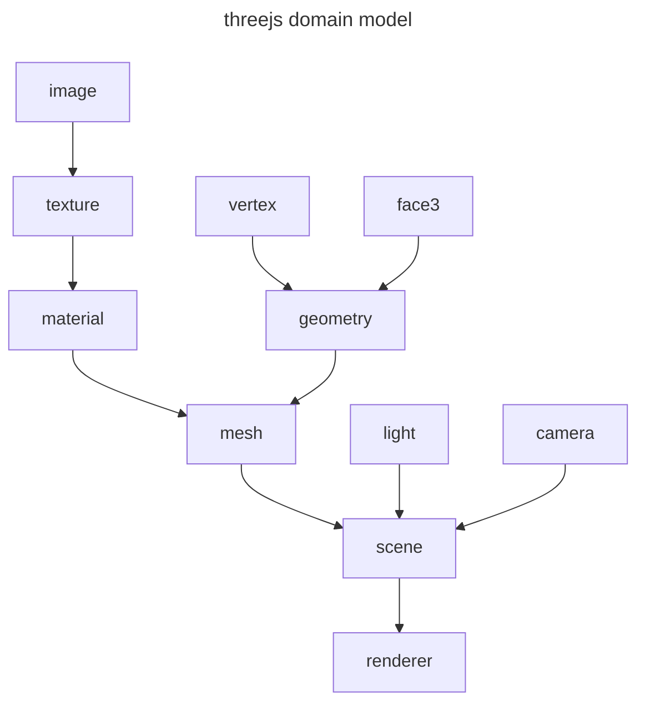

# ThreeJS

[ThreeJS](https://threejs.org/) e un wrapper di [webgl](webgl.md) per l'implementazione di applicazioni grafiche 3D che sfruttano lo stack web, si basa sul concetto di grafo di rendering



L'oggetto fondamentale e la `scene`, che contiene tutti gli elementi renderizzati dalla pipeline, nonché le **informazioni di illuminazione e posizione della camera** negli oggetti `light` e `camera`

l'oggetto `mesh` rappresenta la singola [mesh 3D poligonale](mesh_poligonali.md), di cui viene definita la geometria e le informazioni di colore e texture, nella scena possono essere presenti $n$ mesh 3D

## Animation loop

Per poter renderizzare la scena e necessario creare un animation loop si procede come segue

```javascript
// create an animation loop to render the sceene
function animate() {
	// funzione che comanda la pipeline di renderizzare la scena
  renderer.render( scene, camera );
// logica di aggiornamento della scena
}

// setta la funzione di cui sopra per l'esecuzione in base al refresh rate dello schermo 
renderer.setAnimationLoop( animate );
```

Questo limita la capacita di ricezione degli input da parte dell'utente alla frequenza di refresh rate dello schermo (*in caso di refresh rate a $60hz$ si potrà processare input 60 volte ogni secondo* )

## Manipolare la camera

Per consentire la renderizzazione della scena e necessario definire un'oggetto `Camera` che definisce i parametri di proiezione (*sono disponibili diverse tipologie, prospettiva in primis per simulare la vista umana*) 

```javascript
// si definisce una proiezione in prospettiva in questo caso
const camera = new THREE.PerspectiveCamera( 
	75, // fov
	window.innerWidth / window.innerHeight, // aspect ratio
	0.1, // near
	1000  // far
);
```

[PREVIOUS](pages/rendering_avanzato_webgl.md)
