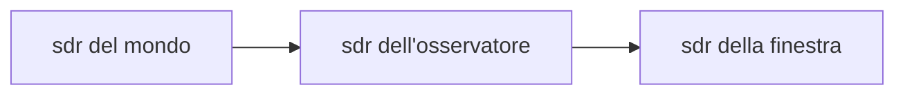
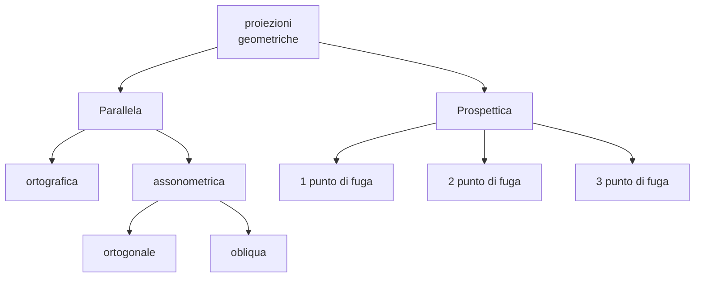
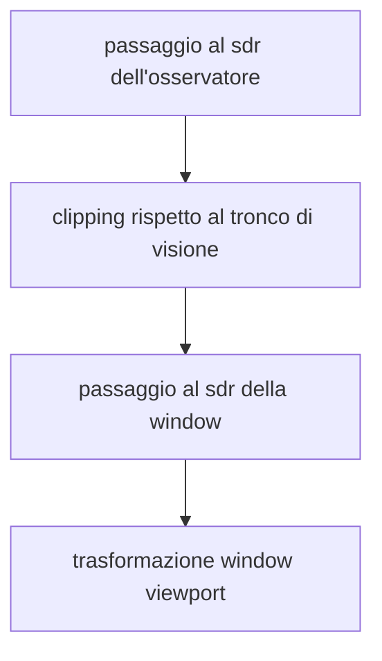

# Trasformazioni di vista

Per poter renderizzare un oggetto 3D in uno schermo esprimerlo per mezzo delle sue coordinate non e sufficiente, e necessario poter trasformare le coordinate dell'oggetto in coordinate del piano immagine

Questo processo si chiama **trasformazione di vista** 

## DAL MONDO ALL'OSSERVATORE

Per poter passare al sistema di riferimento dell'osservatore e necessario identificare la matrice di cambiamento di base $VM$ (*view matrix*), composta come segue

$$
\begin{bmatrix}
Xe\\ Ye \\ Ze \\1
\end{bmatrix} =VM
\begin{bmatrix}
X\\ Y \\ Z \\1
\end{bmatrix}
$$

Data la rappresentazione del vettore $Vu$ in coordinate polari $Vu=[D,\theta,\phi]$ si possono esprimere i vettori del sistema di riferimento dell'osservatore come segue

>[!NOTE] il vettore $Vu$ e parallelo all'asse Z del sistema di riferimento del mondo ed e' **definito nel sistema di riferimento del mondo**

$$
Ze = Vd/\Vert Vd \Vert = -(Vp -O)/\Vert Vp -O \Vert \\
$$
$$
Xe = \frac{Ze \times Vu}{\Vert Ze \times Vu\Vert} \\
$$
$$
Ye = -\frac{Ze \times Xe}{\Vert Ze \times Xe\Vert} \\
$$

$$
VM =\begin{bmatrix}
Xe_{1} &Xe_{2}&Xe_{3}& 0\\
Ye_{1} &Ye_{2}&Ye_{3}& 0\\
Ze_{1} &Ze_{2}&Ze_{3}& D\\
0 &0&0 & 1\\
\end{bmatrix}
$$

Unendo la rappresentazione di $Vu$ in coordinate polari alla struttura della matrice $VM$:

$$
VM =\begin{bmatrix}
-sin(\theta)&cos(\theta)&0& 0\\
-cos(\phi)cos(\theta)&-cos(\phi)sin(\theta)&sin(\phi)& 0\\
-sin(\phi)cos(\theta)&-sin(\phi)sin(\theta)&-cos(\phi)& D\\
0 &0&0 & 1\\
\end{bmatrix}
$$

### PARAMETRI DELLA MATRICE $VM$

i 3 coefficienti  $\theta,\phi,D$ controllano la posizione dell'osservatore, in particolare:

- variando $\theta$ e $\phi$ si può osservare l'oggetto da angolazioni differenti
- variando $D$ si può allontanare o avvicinare il punto di vista dell'osservatore

## DALL'OSSERVATORE ALLA WINDOW

Per poter portare l'immagine sulla window e necessario effettuare una proiezione geometrica, ne esistono di tante tipologie a seconda del punto di vista dell'osservatore

### PROIEZIONE A 3 PUNTI DI FUGA

La proiezione a 3 punti di fuga si ha quando l'osservatore non e allineato con nessun asse del sistema di riferimento del mondo (*caso più generale*)

In questo tipo di proiezione si ha che:

- $y_w=\frac{d\times Y_e}{Z_e}$
- $x_w=\frac{d\times X_e}{Z_e}$

### DETERMINARE LE DIMENSIONI DELLA WINDOW

Le dimensioni della window sono determinate dalla ampiezza del cono di visione che a sua volta e determinato dalla distanza $d$ tra l'osservatore e il piano di proiezione e la semi-ampiezza angolare $\alpha$ del cono di visione 

Inoltre il piano di vista dell'osservatore viene limitato per mezzo di un front-plane e un back-plane

>[!TIP] ne consegue che per definire una matrice di proiezione sul piano di visione e necessario conoscere il formato della finestra,la posizione della camera l'angolo di visione e i piani di troncatura della camera

## STRUTTURA FINALE DELLA PIPELINE DI RENDERING

[PREVIOUS](pages/trasformazioni_geometriche.md) [NEXT](pages/real_time_rendering.md)
