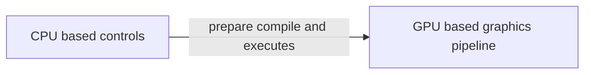
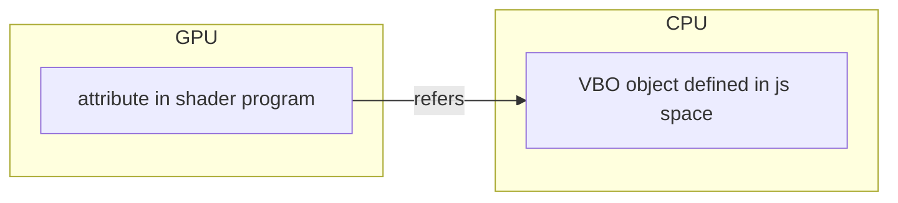

# WebGL

[WebGL](https://it.wikipedia.org/wiki/WebGL) e una libreria grafica basata su [openGL](https://www.opengl.org/) per l'implementazione della grafica 3D in un browser, la pipeline di rendering offerta da WebGL può essere riassunta come segue:


Le API WebGL si dividono in due componenti

- componenti CPU bound per l'elaborazione delle interazioni con il browser e la manipolazione di oggetti
- componenti GPU bound per l'elaborazione accelerata della grafica 3D



## Programmi per gpu: shader

L'elaborazione accelerata viene realizzata per mezzo di programmi, detti **shader** definiti nel linguaggio [GLSL](https://it.wikipedia.org/wiki/GLSL) (*graphic library shader language*), questi si caratterizzano in due tipologie in base ai dati in acquisiti in input

| VERTEX SHADER                        | FRAGMENT SHADER                                |
| ------------------------------------ | ---------------------------------------------- |
| programmi che operano su **vertici** | programmi che operano su **facce di poligoni** |

Il linguaggio GLSL permette i seguenti tipi

```glsl
void 
bool
int //tipo di dato intero con segno
float
vec2, vec3, vec4 //point vector floating point di lunghezza n=2,3,4
bvec2, bvec3, bvec4 //boolean vector
ivec2, ivec3, ivec4 //signed integer vector
mat2, mat3, mat4. //2x2, 3x3, 4x4 floating point matrix
sampler2D //puntatore ad un 2D texture
samplerCube //puntatore ad un cube mapped texture
```

### Compilare uno shader

Una volta scritto il programma shader e necessario compilarlo per mezzo del API CPU bound

```javascript
// Vertex Shader, verra' eseguito nella GPU
var vertCode =
'attribute vec3 coordinates;' + 'void main(void) {' +
' gl_Position = vec4(coordinates, 1.0);' +
'}';
var vertShader = gl.createShader(gl.VERTEX_SHADER);
gl.shaderSource(vertShader, vertCode);
gl.compileShader(vertShader);
// Fragment Shader
var fragCode =
'void main(void) {' +
' gl_FragColor = vec4(0, 0.8, 0, 1);' +
'}';
var fragShader = gl.createShader(gl.FRAGMENT_SHADER);
gl.shaderSource(fragShader, fragCode);
gl.compileShader(fragShader);
```

I due programmi vanno poi linkati fra di loro in un programma unico

```javascript
var shaderProgram = gl.createProgram();
gl.attachShader(shaderProgram, vertShader);
gl.attachShader(shaderProgram, fragShader);
gl.linkProgram(shaderProgram);
gl.useProgram(shaderProgram);
```

### Associare un vertex buffer object a un shader program

Le coordinate dei vertici vengono riferite da uno shader program dai suoi attributi, questi vanno associati a un Vertex Buffer Object definito nello scope javascript



Per associare un VBO a un attribute si procede come segue:

```javascript
// si ottiene un riferimento (la posizione in memoria presumo?) all' attributo all'interno dello shader program
var coord = gl.getAttribLocation(shader_Program,"coordinates");
// si associa il riferimento al VBO attivo nel contesto (quello che ha subito la primitiva bindBuffer)
gl.vertexAttribPointer(coord, 3, gl.FLOAT, false, 0, 0);
```

## Rendering 3d

Per poter renderizzare un oggetto 3D e necessario implementare la [pipeline di vista](trasformazioni_vista.md) con scaling e [proiezione prospettica](proiezione_prospettica.md), che si traduce nel definire le matrici $VM$ $S$ e applicare la [trasformazione magica](proiezione_prospettica.md#TRASFORMAZIONE%20MAGICA)

```javascript
// computazione della matrice di proiezione in prospettiva
function get_projection(angle, a, zMin, zMax) {
	var ang=Math.tan(0.5*angle*Math.PI/180);// 0.5*angle
	return [
	   1/(a*ang), 0 ,   0, 0,
	   0, 1/ang,  0, 0,
	   0, 0, -(zMax+zMin)/(zMax-zMin), -1,
	   0, 0, -(2*zMax*zMin)/(zMax-zMin), 0 ];
}

// computazione della matrice di vista
var view_matrix=
  [1,0,0,0,
   0,1,0,0,
   0,0,1,0,
   0,0,0,1];
// translating z
view_matrix[14]=view_matrix[14]-5;//zoom

// shader program
 var vertCode='attribute vec3 position;'+
 'uniform mat4 Pmatrix;'+
 'uniform mat4 Vmatrix;'+
 'uniform mat4 Mmatrix;'+
 'attribute vec3 color;'+//the color of the point
 'varying vec3 vColor;'+
 'void main(void) { '+//pre-built function
 'gl_Position = Pmatrix*Vmatrix*Mmatrix*vec4(position, 1.);'+
 'vColor=color;'+
 '}';

// compilazione e linking degli shader 
// associazione attributi oggetti 
```

>[!NOTE] l'asse $z$ nello spazio di proiezione di webGL e invertito

## Implementazione dell' [illuminazione](illuminazione.md)

L'illuminazione deve essere implementata con opportuni shader/vertex program (*l'esempio che segue implementa il [gouraud shading](illuminazione.md#GOURAUD%20SHADING)*):

```glsl
//vertex-shader
attribute vec3 position;
attribute vec3 normal;
uniform mat4 projection, modelview, normalMat;
varying vec3 normalInterp;
varying vec3 vertPos;
uniform int mode;

uniform float Ka; // Ambient reflection coefficient
uniform float Kd; // Diffuse reflection coefficient
uniform float Ks; // Specular reflection coefficient
uniform float shininessVal; // Shininess

// Material color
uniform vec3 ambientColor;
uniform vec3 diffuseColor;
uniform vec3 specularColor;
uniform vec3 lightPos; // Light position
varying vec4 color; //color

void main(){
	vec4 vertPos4 = modelview * vec4(position, 1.0);
	vertPos = vec3(vertPos4) / vertPos4.w;
	normalInterp = vec3(normalMat * vec4(normal, 0.0));
	gl_Position = projection * vertPos4;
	vec3 N = normalize(normalInterp);
	vec3 L = normalize(lightPos - vertPos);
	
	// Lambert's cosine law
	float lambertian = max(dot(N, L), 0.0);
	float specular = 0.0;
	
	if(lambertian > 0.0) {
		vec3 R = reflect(-L, N);
		// Reflected light vector
		vec3 V = normalize(-vertPos); // Vector to viewer
		// Compute the specular term
		float specAngle = max(dot(R, V), 0.0);
		specular = pow(specAngle, shininessVal);
	}
	color = vec4(Ka * ambientColor +
	Kd * lambertian * diffuseColor +
	Ks * specular * specularColor, 1.0);
	// only ambient
	if(mode == 2) color = vec4(Ka * ambientColor, 1.0);
	// only diffuse
	if(mode == 3) color = vec4(Kd * lambertian * diffuseColor, 1.0);
	// only specular
	if(mode == 4) color = vec4(Ks * specular * specularColor, 1.0);
}
```

fragment shader:

```glsl
precision mediump float;
varying vec4 color;
//fragment-shader
void main( ) {.
	gl_FragColor = color;
}
```

[PREVIOUS](pages/xwindow_system.md) [NEXT](pages/rendering_avanzato_webgl.md)
