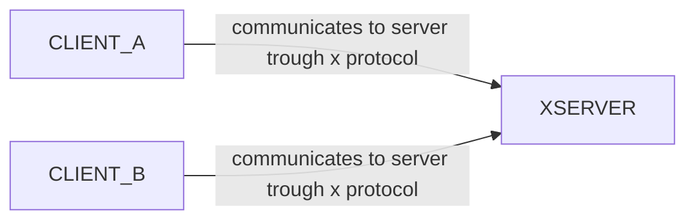

# Xwindow system

Le applicazioni grafiche interagiscono con il display per mezzo di uno stack software che risolve la complessità di amministrare i frame buffer per il display

Uno di questi strati intermedi e il sistema xwindow, architettura client server per il rendering video via rete, che fornisce una implementazione standard delle api opengl

## Xwindow architecture

Dove i client accedono alle risorse esposte dal server via rete che si occupa di implementare la pipeline di renderizzazione.
Il sistema e' pensato per interazioni via rete, (*architetture con client poco prestanti e server potenti*) 

## X protocol

Il protocollo x prevede 3 tipi di messaggi:

- **richieste** (*client -> server*) effettuate per accedere alle risorse, asincrone (*dispatch*)
- **risposte** (*server -> client*) ottenute dal server in seguito a una richiesta
- **eventi** (*server -> client*) il server notifica i client in maniera asincrona e proattiva

[PREVIOUS](pages/html5.md) [NEXT](pages/webgl.md)
